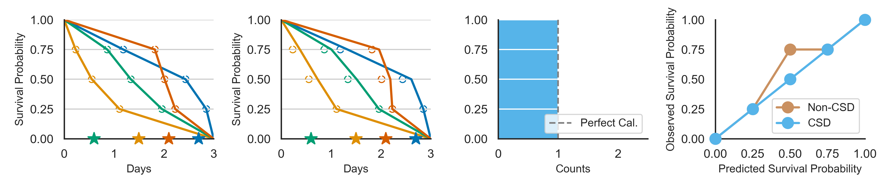

# Conformal Survival Distribution

This official repository contains the code for the ICML 2024 paper: 
"Conformalized Survival Distributions: A Generic Post-Process to Increase Calibration", [link](https://arxiv.org/abs/2405.07374).

Discrimination and calibration represent two important properties of survival analysis, with the
former assessing the model’s ability to accurately rank subjects and the latter evaluating the alignment of predicted outcomes with actual events.
With their distinct nature, it is hard for survival models to simultaneously optimize both of them
especially as many previous results found improving calibration tends to diminish discrimination
performance. This paper introduces a novel approach utilizing conformal regression that can
improve a model’s calibration without degrading discrimination. We provide theoretical guarantees
for the above claim, and rigorously validate the efficiency of our approach across 11 real-world
datasets, showcasing its practical applicability and robustness in diverse scenarios.

|                                                                                                                                                                                                                                                                                                                                                                                 | 
|:------------------------------------------------------------------------------------------------------------------------------------------------------------------------------------------------------------------------------------------------------------------------------------------------------------------------------------------------------------------------------------------------------------------------------:| 
| *Example of using Conformal Survival Distribution (CSD) to make the prediction D-calibrated. (a) Discretize the predicted survival distributions at three percentile levels (25%, 50%, 75%); (b) Generate the new ISD by adjusting the PCTs, where the hollow points are the old PCTs; (c) Calculate the D-cal histogram using the adjusted ISDs; (d) P-P plot comparing the D-cal level between non-CSD and CSD predictions.* |


This repository contains the code for the experiments in the paper. The code is organized as follows:
- `args/`: The arguments for the experiments.
- `data/`: The datasets used in the experiments. (Here we only provide some of the datasets, but you can download the rest of them from the original sources. Referenced in the paper)
- `figs/`: The figures presented in the paper.
- `icp/`: The implementation of the conformalized survival distribution (`CSD`).
- `models/`: Some self-implemented models (`DeepSurv`, `N-MTLR`, and `LogNormalNN`) used in the experiments.
- `utils/`: The utility functions used in the experiments.
- `requirements.txt`: The requirements file to install the necessary packages.
- `README.md`: This file.
- `LICENSE`: The license file.
- `run.py`: The main script to run the `CSD`.
- `run_baselines.py`: The script to run the `non-CSD` baselines.


## Environment Setup


### Prerequisites

create a virtual environment with Python version 3.11.5

```
conda create -n CSD python=3.11.5
```
Then
install the requirements.txt file
```
pip install -r requirements.txt
```


### Make Folder/Packages as Source Code
Install the [`SurvivalEVAL`](https://github.com/shi-ang/SurvivalEVAL) package as source code.

Clone the repo, cd into it and install it in editable mode (-e option). That way, these are no more need to re-install the package after modification.

```bash
git clone https://github.com/shi-ang/SurvivalEVAL.git
cd SurvivalEVAL
pip install -r requirements.txt
pip install -e . 
```


### `PyCox` Package Issue
`PyCox` package is not compatible with the latest version of pandas (> 2.0.0).
If you are experiencing issues with the `PyCox` package (especially with the `CoxTime` model), you can consider downgrade the pandas version.
Or you can fix the issue by modifying the `PyCox` package.

To be specific, go to the path `[env_path]/lib/python3.11/site-packages/pycox/model` and change the outdated code in `cox_time.py` and `data.py` file.


# Running the Experiments

Using the provided codes, reader can run the experiments on a few datasets: `VALCT`, `PBC`, `gbsg`, `NACD`,  `SUPPORT`.

To run the experiments, you can use the following scripts:
```bash
python3 run.py --data [choice_of_data] --model [choice_of_baseline]
```
To compare the `CSD` with the baselines, you can use the following script:
```bash
python3 run_baselines.py --data [choice_of_data] --model [choice_of_baseline]
```

For example, to run the experiments on the `SUPPORT` dataset using the `AFT` model, you can use the following script:
```bash
python3 run.py --data SUPPORT --model AFT
python3 run_baselines.py --data SUPPORT --model AFT
```

